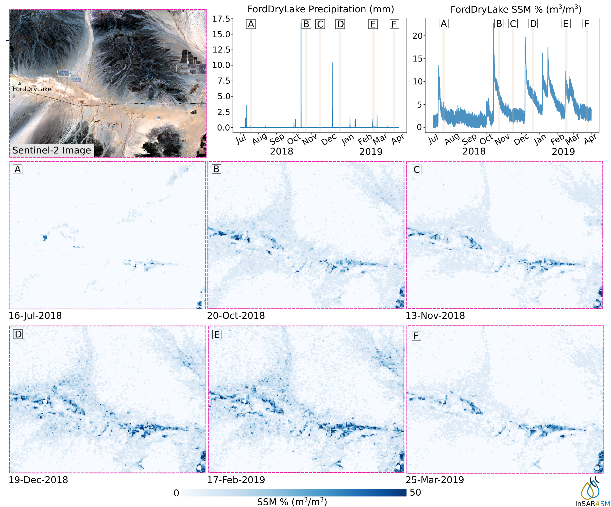

.. InSAR4SM documentation master file, created by
   sphinx-quickstart on Sat Oct  15 13:58:33 2022.
   You can adapt this file completely to your liking, but it should at least
   contain the root `toctree` directive.

Welcome to InSAR4SM's documentation!
====================================

What is InSAR4SM?
-----------------

The Interferometric Synthetic Aperture Radar for Soil moisture (InSAR4SM) is a free and open-source python toolbox for estimating soil moisture from interferometric observables.

How does it work?
-----------------

InSAR4SM is a free and open-source software for estimating soil moisture using interferometric observables. It requires as inputs a) a Topstack ISCE SLC stack and b) a meteorological dataset (e.g. ERA5-Land data). The main output result is a point vector file that contains soil moisture information over time.
InSAR4SM provide soil moisture estimations using interferometric observables and meteorological data using a 5-step framework. 
- Identification of driest SAR image based on meteorological information.
- Calculation of interferometric observables (coherence and phase closure).
- Identification of SAR acquisitions related to dry soil moisture conditions using coherence and amplitude information.
- Calculation of coherence information due to soil moisture variations.
- Soil moisture inversion using De Zan`s model.

.. seealso::
    Algorithms implemented in the software are described in detail at our publication. If InSAR4SM was useful for you, we encourage you to cite the following work.

    - Karamvasis K, Karathanassi V. Soil moisture estimation from Sentinel-1 interferometric observations over arid regions.(under review). Preprint available `here <https://arxiv.org/abs/2210.10665>`_.

Contact us
----------
Feel free to open an issue, comment or pull request. We would like to listen to your thoughts and your recommendations.
Any help is very welcome!

.. toctree::
   :hidden:
   :maxdepth: 4
   :caption: Contents:
   
   quickstart
   installation
   modules
   
Indices and tables
==================

* :ref:`genindex`
* :ref:`modindex`
* :ref:`search`
